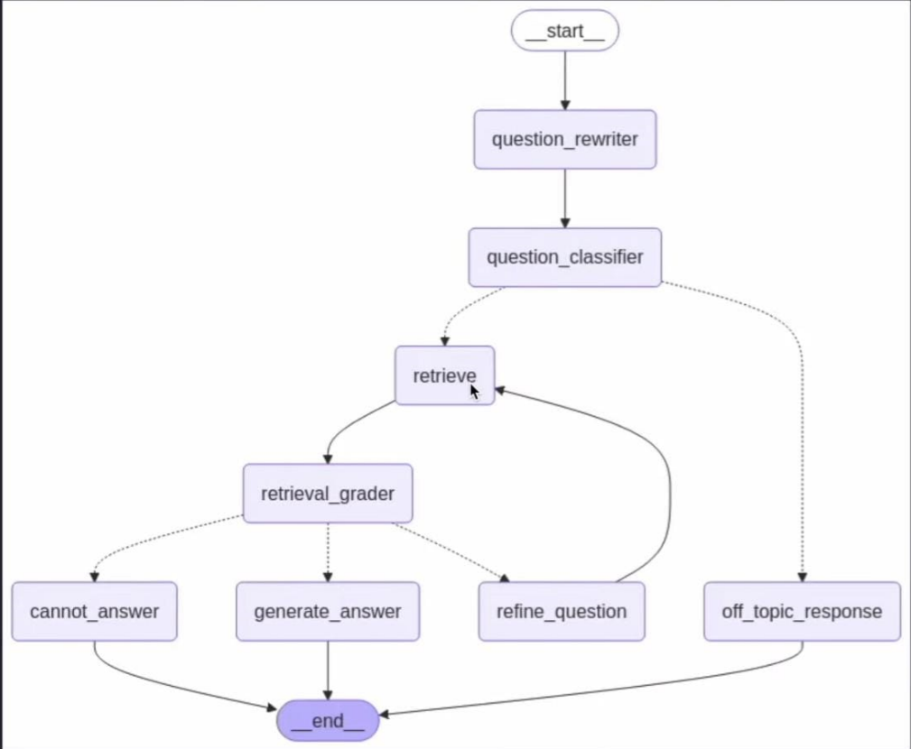

# Multi_step_reasoning-bot-using-Langgraph

##Gale Encyclopedia of medicine volume 4 data has been successfully added to the llm. This multiagent tool provides the answers to all the questions related to the book context.

Also consider adding your course books to the code base and just edit the prompt under "def content". 